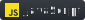
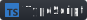
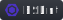

### About me 👋

Hy, I'm Amabelle, and I'm a Full-Sack / Front-End developer 😊

- ✨ I'm currently learnig and implemnting Next.js in personal projects.
- 👩‍💻 I'm working at a small startup company with react.js, matirial-ui, node.js & mongodb.
- 💖 Check out my npm project - writen in typescript, implemented with react, ESbuild, lerna, node.js and express. published to npm.
- 👯 I’m looking for an open source project to contribute to.
- 🌱 I’m looking to collaborate on social network for gardeners and community gardens, start a new one.
- 💬 Ask me everything about react.js
- ⚡ CSS, HTML, JS, REST API (CRUD), React.js & hooks ,Redux, Typescrips, Node.js, Express, MongoDB, Mongoose, SQL, Firebase, Docker, and more.
- 📫 How to reach me: [My linkedIn](https://www.linkedin.com/in/amabelle-trachtenberg/)

<!--
**amabelleS/amabelleS** is a ✨ _special_ ✨ repository because its `README.md` (this file) appears on your GitHub profile.

Here are some ideas to get you started:

- 🔭 I’m currently working on my new blog-protfolio (v2)
- 🌱 I’m currently learning typescript
- 👯 I’m looking to collaborate on ...
- 🤔 I’m looking for help with ...
- 💬 Ask me about react
- 📫 How to reach me: ...
- 😄 Pronouns: ...
- ⚡ Fun fact: ...
-->
### 🛠 Technologies and Tools

&nbsp;
&nbsp;
&nbsp;
&nbsp;
&nbsp;
&nbsp;
&nbsp;
&nbsp;
&nbsp;
&nbsp;
&nbsp;
&nbsp;
&nbsp;
&nbsp;
&nbsp;

